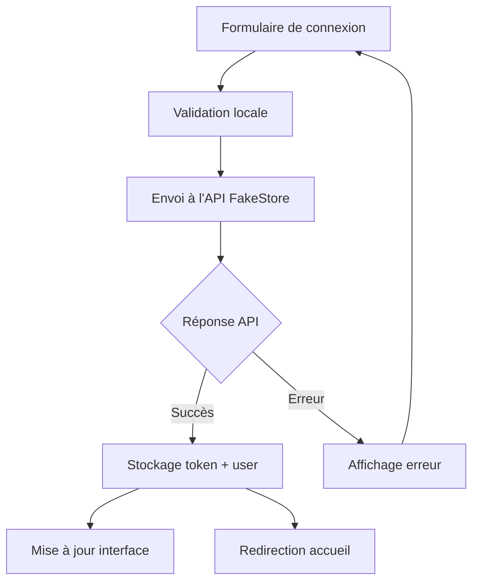

# Guide d'Authentification - Mock&Shop

## 🎯 Fonctionnalités implémentées

### ✅ **Formulaire de connexion intelligent**
- Connexion à l'API FakeStore avec validation
- Validation des champs en temps réel avec messages d'erreur
- État de chargement avec spinner animé
- Section d'aide avec identifiants de test (mode développement)
- Auto-remplissage des identifiants via bouton ou console

### ✅ **Gestion d'état centralisée**
- Composable `useAuth()` pour la gestion d'authentification
- Stockage persistant du token et des informations utilisateur
- État réactif synchronisé entre tous les composants

### ✅ **Interface utilisateur adaptative**
- NavBar avec état d'authentification
- Affichage conditionnel : "Connexion" vs "Bienvenue [user]"
- Bouton de déconnexion avec confirmation
- Notifications toast pour feedback utilisateur

### ✅ **Gestion des erreurs avancée**
- Messages d'erreur spécifiques selon le type d'erreur HTTP
- Validation côté client pour une meilleure UX
- Fallback pour les erreurs réseau

## 🔐 Identifiants de test validés

| Utilisateur | Username | Password | Statut |
|-------------|----------|----------|---------|
| **Principal** | `mor_2314` | `83r5^_` | ✅ Recommandé |
| Alternatif 1 | `kevinryan` | `kev02937@` | ✅ Valide |
| Alternatif 2 | `donero` | `ewedon` | ✅ Valide |
| Alternatif 3 | `derek` | `jklg*_56` | ✅ Valide |

## 🚀 Comment tester

### **Méthode 1 - Interface utilisateur**
1. Accédez à la page de connexion : http://localhost:5173/signIn
2. Utilisez les identifiants de test (section bleue en haut du formulaire)
3. Cliquez sur "Remplir automatiquement" ou saisissez manuellement
4. Cliquez sur "Se connecter"

### **Méthode 2 - Console développeur**
1. Ouvrez la console (F12)
2. Tapez `fillTestCredentials()` et appuyez sur Entrée
3. Cliquez sur "Se connecter"

### **Méthode 3 - Navigation directe**
1. Cliquez sur "Connexion" dans la NavBar
2. Suivez la méthode 1

## 💾 Persistance des données

### Stockage automatique
```javascript
// Token JWT dans localStorage
localStorage.getItem('authToken')

// Informations utilisateur
localStorage.getItem('user') 
// Contient: { username, loginTime }
```

### Restauration de session
- L'état d'authentification est automatiquement restauré au rechargement
- Le composable `useAuth()` vérifie le localStorage au démarrage
- L'interface se met à jour automatiquement

## 🔄 Flux d'authentification



## 🎨 États de l'interface

### 🔴 **Non connecté**
- NavBar affiche : `[🔍] [Connexion] [🛒]`
- Accès libre à toutes les pages publiques

### 🟢 **Connecté**
- NavBar affiche : `[🔍] [👋 username] [Déconnexion] [🛒]`
- Token disponible pour les requêtes authentifiées

### ⚡ **En cours de connexion**
- Formulaire désactivé avec spinner
- Message "Connexion..." sur le bouton
- Empêche les double-clics

## 🔧 Architecture technique

### **Composants principaux**
```
src/
├── components/
│   ├── user/SignInForm.vue          # Formulaire de connexion
│   └── layout/NavBar.vue            # Navigation avec état auth
├── composables/
│   ├── useAuth.js                   # Logique d'authentification
│   └── useNotifications.js          # Système de notifications
└── services/
    └── api.js                       # Couche API avec authService
```

### **API utilisée**
- **Endpoint** : `https://fakestoreapi.com/auth/login`
- **Méthode** : POST
- **Body** : `{ username, password }`
- **Réponse** : `{ token: "JWT..." }`

## 🎯 Prochaines étapes suggérées

### 🚀 **Fonctionnalités à ajouter**
1. **Middleware de route** - Protection des pages privées
2. **Rafraîchissement automatique** - Gestion expiration token
3. **Profil utilisateur** - Page dédiée avec informations
4. **Remember me** - Option de connexion persistante
5. **Reset password** - Fonctionnalité mot de passe oublié

### 🔒 **Sécurité à renforcer**
1. **HTTPS en production** - Transport sécurisé
2. **Validation token côté serveur** - Vérification JWT
3. **Logout automatique** - Déconnexion après inactivité
4. **CSP Headers** - Protection XSS

### 📱 **UX/UI à améliorer**
1. **Mode sombre** - Thème adaptatif
2. **Animations** - Transitions fluides
3. **PWA** - Application progressive
4. **Accessibilité** - ARIA et navigation clavier

## 🐛 Dépannage

### ❌ **Problèmes courants**

| Problème | Cause probable | Solution |
|----------|----------------|----------|
| "Token non reçu" | API indisponible | Vérifier connexion internet |
| "401 Unauthorized" | Identifiants incorrects | Utiliser les identifiants de test |
| Notifications absentes | Composant manquant | Vérifier NotificationToast dans App.vue |
| Interface non mise à jour | État non réactif | Redémarrer l'application |

### 🔍 **Debug en mode développement**
```javascript
// Console debug commands
window.fillTestCredentials()  // Remplir identifiants
localStorage.clear()          // Vider stockage
```

### 📊 **Monitoring**
- Toutes les actions d'auth sont loggées dans la console
- Émojis pour identifier rapidement les events :
  - 🔐 Tentative de connexion
  - ✅ Connexion réussie  
  - ❌ Erreur de connexion
  - 👋 Déconnexion
  - 🧪 Mode développement

## 🎉 Conclusion

L'authentification de Mock&Shop est maintenant **entièrement fonctionnelle** avec :
- ✅ Connexion/déconnexion fluide
- ✅ Persistance de session
- ✅ Interface adaptative  
- ✅ Gestion d'erreurs robuste
- ✅ Outils de développement

**Prêt pour la production !** 🚀
